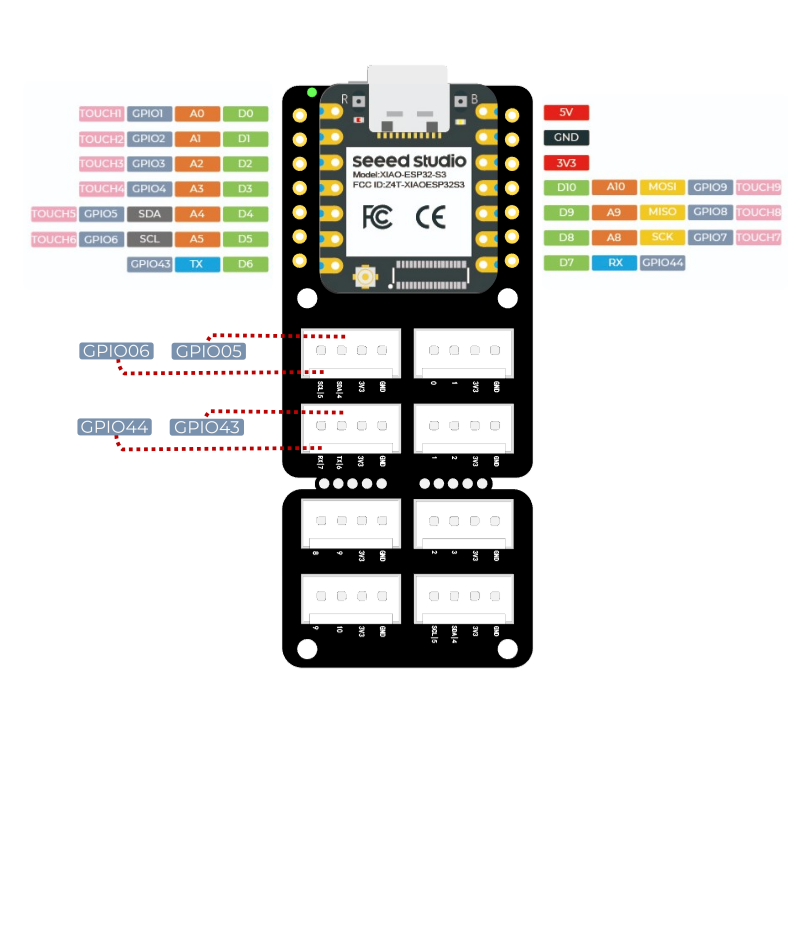
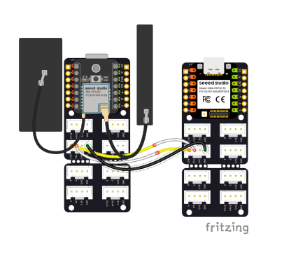
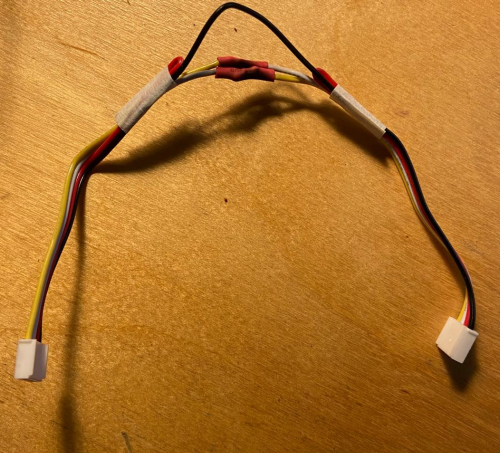

# monkey-mesh
### Experiments around Mesh Networks (mainly Meshtastic)

This repository's main goal is to serve as sketchbook on several experimentation around Meshtastic and its integration and stretching to different scenarios (i.e. Automation, Monitoring, Storytelling)

It all stems from **[a thought](https://www.reddit.com/r/meshtastic/comments/1d07e7j/meshtastic_thermal_printer_ticker_tape_node/) I had a year ago: how to save and somehow record these ephemeral-ethereal messages in our absence?**

Attach a printer to a meshtastic radio and see the messages coming one after another, a real physical representation of the conversations.

This project was an excuse to see how far a meshtastic radio could be integrated into a more distributed and complex system. 

A number of things can be built from here, including - in addition to the printer from which we start - **a small bot capable of field operations**, or even **a very simple BBS** (Bulletin board system) **based on microntrollers**. 

Here are some examples I've found useful in this path. 

### What we need: 
- a meshtastic radio (I am using a [XIAO ESP32S3 & Wio-SX1262 Kit for Meshtastic & LoRa](https://www.seeedstudio.com/Wio-SX1262-with-XIAO-ESP32S3-p-5982.html?)
- a second radio from which to send data (paired with a cell phone)
- a microcontroller (in early experiments I used a Xiao SAMD21, and then used another Xiao ESP32S3)
- a voltage converter
- a switch
- two [Xiao Grove Shields](https://wiki.seeedstudio.com/Grove-Shield-for-Seeeduino-XIAO-embedded-battery-management-chip/) (for purely educational purposes - I'm getting old. You can skip them if you want to make you project tinier and save money. 

### Software side, we use:
- [meshtastic web flasher](https://flasher.meshtastic.org/)
- [meshtastic console](https://client.meshtastic.org/)
- [Arduino IDE with ESP32 core](https://wiki.seeedstudio.com/xiao_esp32s3_getting_started/#software-preparation)
- [Meshtastic's Protobuf library for Arduino](https://github.com/meshtastic/Meshtastic-arduino)

## 1) Flashing Radio n° 1

Visit [meshtastic web flasher](https://flasher.meshtastic.org/) and follow the instructions. 

## 2) Configuring the Radio

While you can go on from here using the Android or iOS app, I'll stick with the [meshtastic console](https://client.meshtastic.org/). 
We are going to **define its Serial pins** (based on Xiao's pin mapping) and **enable protobuf communication**. 

Since I'm using the [Xiao Grove Shields](https://wiki.seeedstudio.com/Grove-Shield-for-Seeeduino-XIAO-embedded-battery-management-chip/) I'm also sharing this useful image of the pin mapping. 

## 3) Listening to the Serial Port using Protobuf from another Xiao

Let's connect the two boards in this way. 
Important TX is going to RX, and viceversa. Do not connect 3V3 for now. 

In order to have a cable for the serial communication I changed a grove connector making it usable changing TX to RX and vice versa. 

After installed the library, we can run this code in order to read whichever is passing via the serial and read all the nodes received in the serial port. Don't worry: we are going to fine tune this code in order to do less.

proto-all.ino

